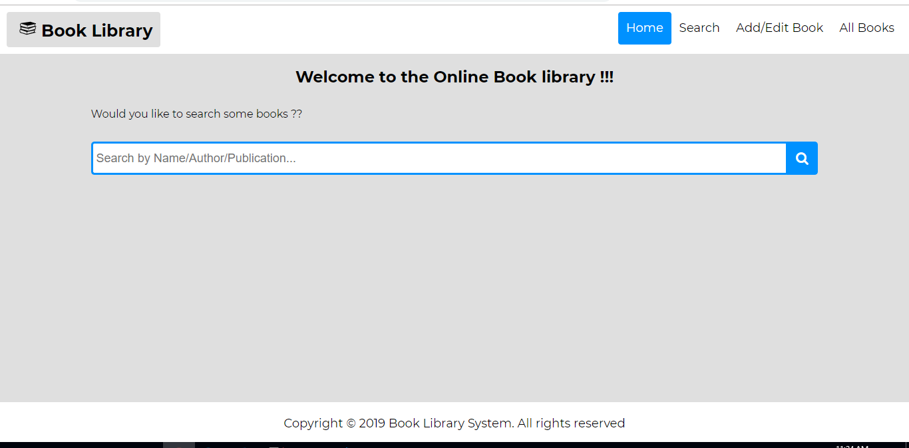
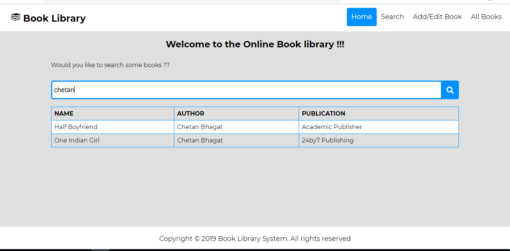
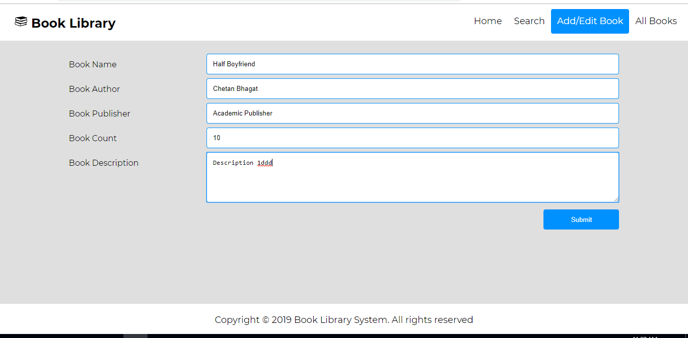
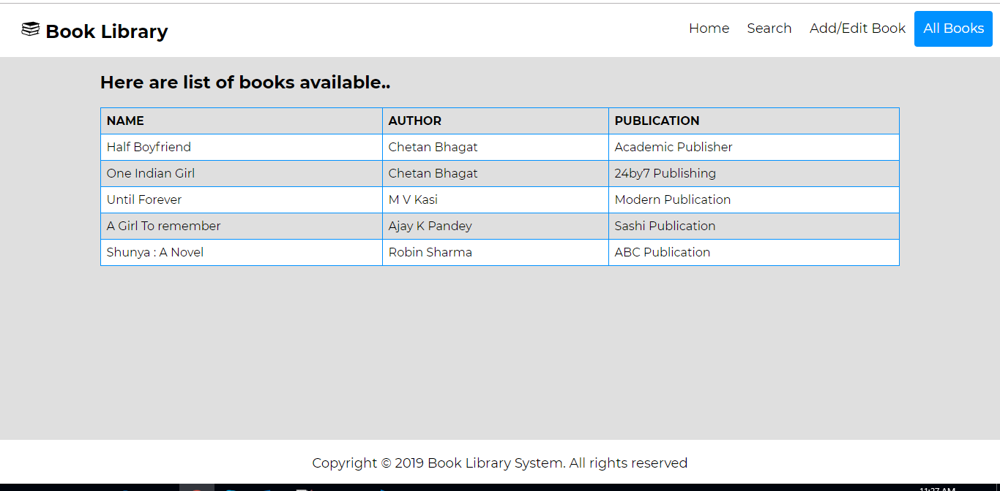
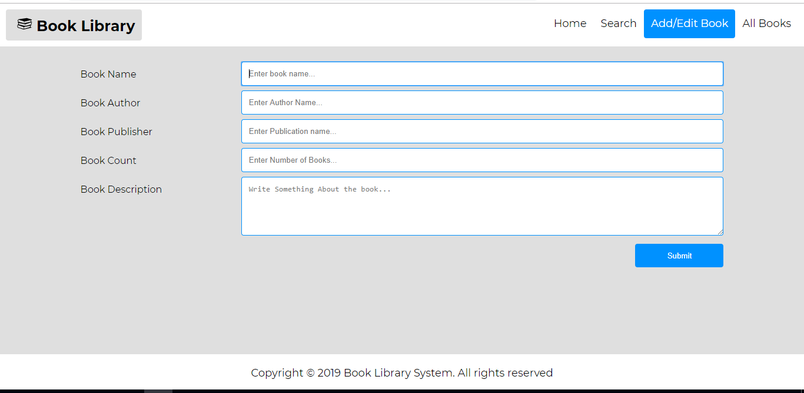

# Online Sample Book Library
This is a sample online book library web application which is used to search book, 
edit book and view all books.

- [Online Sample Book Library](#online-sample-book-library)
  - [Introduction](#introduction)
    - [Library and Frameworks Used](#library-and-frameworks-used)
    - [Development mode](#development-mode)
  - [Quick Start](#quick-start)
    - [Client App](#client-app)
    - [Server App](#server-app)
  - [Documentation](#documentation)
    - [Folder Structure](#folder-structure)
    - [Quick Guide](#quick-guide)
    - [Screens](#screens)
    - [Limitation](#limitation)

## Introduction

This project was bootstrapped with [Create React App](https://github.com/facebook/create-react-app).

This is a simple full stack [React](https://reactjs.org/) application with a [Node.js](https://nodejs.org/en/) and [Express](https://expressjs.com/) backend. Client side code is written in React and the backend API is written using Express.

### Library and Frameworks Used

    - React
    - React Router
    - Webpack
    - Redux
    - Node.js
    - Express
    - Reselect
    - Node Sass
    - Http Client
        - Axios

### Development mode

In the development mode, we will have 2 servers running. The front end code will be served by the [webpack dev server](https://webpack.js.org/configuration/dev-server/) which helps with hot and live reloading. The server side Express code will be served by a node server.

## Quick Start

```bash
# Clone the repository
git clone https://github.com/PRASHANTK22111993/book-lib-sys

# Go inside the directory
cd book-lib-sys

# Install dependencies
npm install

# Start client and server application
npm start
```

It will the app in the development mode.<br>

### Client App

Open [http://localhost:3000](http://localhost:3000) to view it in the browser.

### Server App

Open [http://localhost:8080/api/getBooksList](http://localhost:8080/api/getBooksList) to 
view it in the browser.

The page will reload if you make edits in the client code.<br>

## Documentation

### Folder Structure

All the source code will be inside **root** directory. Inside root directory there is **client** and **server** directory. All the frontend code (react, scss, js and other static assets) will be in **client** directory. All the Backend code(Node.js and express) will be in **server** directory.

    - client (Client Side code)
        - app (Entry point and root componnets)
        - appconfig (Client app configuration files)
        - assets (Scss files and images)
        - components (Container Components)
            - AddBook (Add or Edit Book Container)
            - Home (Home Page Container)
            - Layout (Basic Layout Container)
            - SearchBook (Search Book Container)
            - ViewAllBook (View All Book Container)
        - shared (Common utility, components, store)
            - appStore (Redux Store, Action Creator and Reducers)
            - components (input, button, header, footer, loader, ....)
            - services (Wrapper for making api call)
            - staticAssets (SVG files)
            - utils (Common Utility)
        - tests (Test Cases)
    - config (Configuartion files - webpack, jest, ...)
    - scripts (Scripts files)
    - server (Server Side code)
    - public (Static files)

### Quick Guide

Open [http://localhost:3000](http://localhost:3000) to view it in the browser.

User will be landing to the homepage of the application where user can search for books, add or edit books

    - Search by name/author/publication (Enter search term "chetan")
    - It will list the books available using search term.
    - Click on any of the book from list then, user will be taken to the 
        Edit Page where the book details can be updated.
    - Alternatively, user can add the book by clicking on Add/Edit menu present at the header menu.
    - View All Option can be used to view all the books availble in the librray.

### Screens







### Limitation

Since, the books are getting served at initial load from get api present in server side code. whatever changes(add/edit) made by client app will be in live memory (redux store), searching, editing and addition of books will work until user refreshes the page. As soon as user refreshes the page the changed data will be lost and will reload the initial data from server again.

Solution would be post the changed data to the server. 
